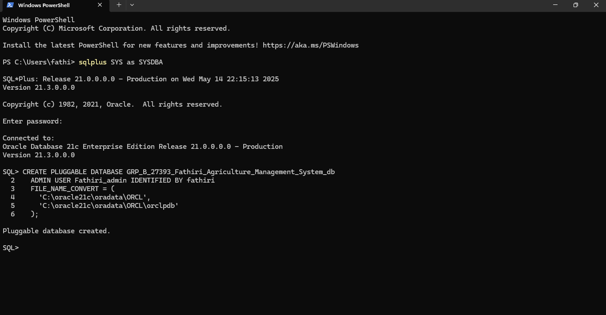
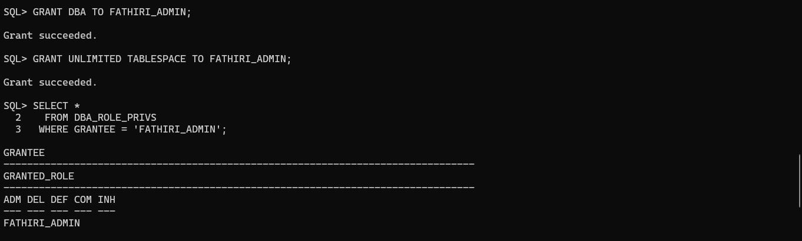
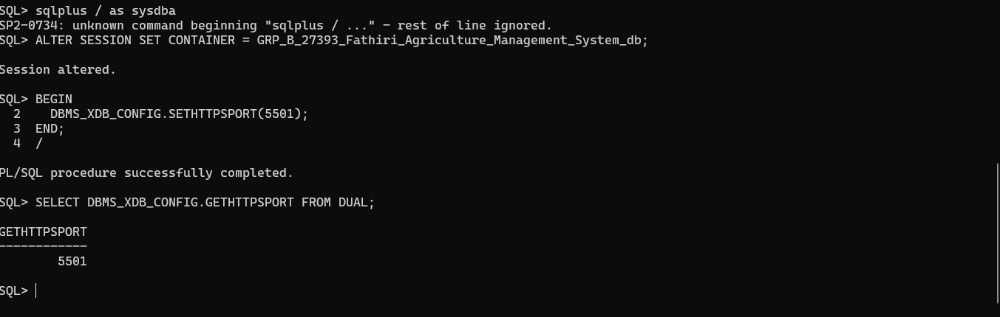

# TUE_27393_FATHIRI_AGRICULTURE_MANAGEMENT_SYSTEM_DB

## Phase IV: PDB CREATION AND CONNECTING WITH ORACLE ENTEPRISE MANAGER

PROBLEM STATEMENT:
Small farmers here still write everything down by hand or use different apps to track planting, fertilizer and feed use, health tasks like vaccinations or pest control, and their harvests. This makes it hard for them to know exactly how much input to use, slows down advice from cooperatives, and leaves regional managers guessing how to distribute resources or run training. Our Agricultural Management System brings it all together in one easy-to-use platform: farmers can register, plan seasons, log activities, and record harvests; cooperatives get instant, consistent reports and a way to send feedback; and administrators see clear dashboards and trends to decide where to send supplies and schedule workshops. With just a few clicks, everyone has the information they need to work smarter and faster.

### CREATING PLUGABLLE DATABASE


### GRANTING PRIVILEGES


### CONNECTION TO ORACLE ENTPRISE MANAGER


### STATUS OF ORACLE ENTEPRISE MANAGER



## Phase V: CREATING AND INSERTING DATA

### CREATING TABLES

```sql

CREATE TABLE Farmer (
  farmer_id    NUMBER GENERATED BY DEFAULT ON NULL AS IDENTITY PRIMARY KEY,
  name         VARCHAR2(100) NOT NULL,
  contact      VARCHAR2(100)
);

CREATE TABLE Cooperative (
  coop_id      NUMBER GENERATED BY DEFAULT ON NULL AS IDENTITY PRIMARY KEY,
  name         VARCHAR2(100) NOT NULL,
  location     VARCHAR2(100)
);
CREATE TABLE Asset (
  asset_id     NUMBER GENERATED BY DEFAULT ON NULL AS IDENTITY PRIMARY KEY,
  farmer_id    NUMBER NOT NULL,
  type         VARCHAR2(20)  NOT NULL CHECK (type IN ('CROP','LIVESTOCK')),
  subtype      VARCHAR2(50)  NOT NULL,
  CONSTRAINT fk_asset_farmer FOREIGN KEY(farmer_id)
    REFERENCES Farmer(farmer_id)
);

CREATE TABLE Season (
  season_id      NUMBER GENERATED BY DEFAULT ON NULL AS IDENTITY PRIMARY KEY,
  asset_id       NUMBER NOT NULL,
  start_date     DATE         NOT NULL,
  expected_yield NUMBER(10,2) DEFAULT 0,
  CONSTRAINT fk_season_asset FOREIGN KEY(asset_id)
    REFERENCES Asset(asset_id)
);

CREATE TABLE Activity (
  activity_id    NUMBER GENERATED BY DEFAULT ON NULL AS IDENTITY PRIMARY KEY,
  season_id      NUMBER NOT NULL,
  activity_type  VARCHAR2(50) NOT NULL CHECK (activity_type IN (
                      'Planting','Fertilization','Pest Control',
                      'Vaccination','Disease Control','Feeding','Health Check')),
  amount         NUMBER(10,2) NOT NULL,
  activity_date  DATE         NOT NULL,
  CONSTRAINT fk_activity_season FOREIGN KEY(season_id)
    REFERENCES Season(season_id)
);
CREATE TABLE Harvest (
  harvest_id     NUMBER GENERATED BY DEFAULT ON NULL AS IDENTITY PRIMARY KEY,
  season_id      NUMBER NOT NULL UNIQUE,
  actual_yield   NUMBER(10,2) NOT NULL,
  harvest_date   DATE         NOT NULL,
  CONSTRAINT fk_harvest_season FOREIGN KEY(season_id)
    REFERENCES Season(season_id)
);
CREATE TABLE Report (
  report_id    NUMBER GENERATED BY DEFAULT ON NULL AS IDENTITY PRIMARY KEY,
  season_id      NUMBER NOT NULL,
  coop_id        NUMBER NOT NULL,
  report_text  CLOB         NOT NULL,
  report_date  DATE         NOT NULL,
  CONSTRAINT fk_report_season FOREIGN KEY(season_id)
    REFERENCES Season(season_id),
  CONSTRAINT fk_report_coop   FOREIGN KEY(coop_id)
    REFERENCES Cooperative(coop_id)
);


commit;

```
###  INSERTING DATA INTO TABLES 

```sql

INSERT INTO Farmer (name, contact) VALUES ('Alice N.', 'alice@example.com');
INSERT INTO Farmer (name, contact) VALUES ('Bob M.',   'bob@example.com');
INSERT INTO Farmer (name, contact) VALUES ('Benjamin B.',   'benjamin@example.com');
INSERT INTO Farmer (name, contact) VALUES ('Blaise K.',   'blaise@example.com');

INSERT INTO Cooperative (name, location) VALUES ('DUTERIMBERE', 'BUGESERA');
INSERT INTO Cooperative (name, location) VALUES ('INDANGAMIRWA', 'MUSANZE');
INSERT INTO Cooperative (name, location) VALUES ('KORA WIGIRE', 'BURERA');

INSERT INTO Asset (farmer_id, type, subtype) VALUES (1, 'CROP',      'Maize Hybrid');
INSERT INTO Asset (farmer_id, type, subtype) VALUES (1, 'LIVESTOCK', 'Goat');
INSERT INTO Asset (farmer_id, type, subtype) VALUES (2, 'CROP',      'Cassava');
INSERT INTO Asset (farmer_id, type, subtype) VALUES (1, 'LIVESTOCK', 'Chicken');
INSERT INTO Asset (farmer_id, type, subtype) VALUES (1, 'LIVESTOCK', 'Cow');
INSERT INTO Asset (farmer_id, type, subtype) VALUES (1, 'LIVESTOCK', 'Pig');
INSERT INTO Asset (farmer_id, type, subtype) VALUES (2, 'CROP',      'Sweet Potatoes');
INSERT INTO Asset (farmer_id, type, subtype) VALUES (2, 'CROP',      'Vegetables');
INSERT INTO Asset (farmer_id, type, subtype) VALUES (2, 'CROP',      'Tomatoes');
INSERT INTO Asset (farmer_id, type, subtype) VALUES (1, 'LIVESTOCK', 'Sheep');
INSERT INTO Asset (farmer_id, type, subtype) VALUES (1, 'LIVESTOCK', 'Rabbit');

INSERT INTO Season (asset_id, start_date, expected_yield)
  VALUES (1, DATE '2025-03-01', 1000);
INSERT INTO Season (asset_id, start_date, expected_yield)
  VALUES (2, DATE '2025-02-15',    50);
INSERT INTO Season (asset_id, start_date, expected_yield)
  VALUES (3, DATE '2025-04-01',  800);
  


INSERT INTO Activity (season_id, activity_type, amount, activity_date)
  VALUES (1, 'Planting',     1000, DATE '2025-03-02');
INSERT INTO Activity (season_id, activity_type, amount, activity_date)
  VALUES (1, 'Fertilization',  50, DATE '2025-03-10');
INSERT INTO Activity (season_id, activity_type, amount, activity_date)
  VALUES (1, 'Pest Control',   10, DATE '2025-04-01');
  
  
INSERT INTO Activity (season_id, activity_type, amount, activity_date)
  VALUES (1, 'Vaccination',   10, DATE '2025-04-01'); 
  
  
  INSERT INTO Activity (season_id, activity_type, amount, activity_date)
  VALUES (1, 'Feeding',   10, DATE '2025-04-01'); 
  
  INSERT INTO Activity (season_id, activity_type, amount, activity_date)
  VALUES (1, 'Disease Control',   10, DATE '2025-04-01');  
  
   INSERT INTO Activity (season_id, activity_type, amount, activity_date)
  VALUES (1, 'Health Check',   10, DATE '2025-04-01');  
  
  
  
  

INSERT INTO Harvest (season_id, actual_yield, harvest_date)
  VALUES (1, 950, DATE '2025-06-15');
INSERT INTO Harvest (season_id, actual_yield, harvest_date)
  VALUES (2,  45, DATE '2025-05-20'); 
  
INSERT INTO Report (season_id, coop_id, report_text, report_date)
  VALUES (1, 1, 'Reduce fertilizer in next cycle; watch for late pests.', DATE '2025-06-20');
INSERT INTO Report (season_id, coop_id, report_text, report_date)
  VALUES (2, 2, 'Increase feed frequency; schedule health checks monthly.', DATE '2025-05-25');


  commit

```

## Phase VI:
  ### DDL&DML 
```sql

INSERT INTO Farmer (name, contact)
VALUES ('Charlie P.', 'charlie@gmail.com');


UPDATE Asset
SET subtype = 'Maize Local'
WHERE asset_id = 1;


DELETE FROM Report
WHERE report_id = 2;


CREATE TABLE TestTable (
  id           NUMBER PRIMARY KEY,
  created_date DATE DEFAULT SYSDATE
);

ALTER TABLE TestTable
ADD (description VARCHAR2(200));


DROP TABLE TestTable;

commit;

```
### PACKAGES

```sql
CREATE OR REPLACE PACKAGE farm_pkg IS
  PROCEDURE get_farm_activities(p_farmer_id IN NUMBER);
  FUNCTION  get_total_yield(p_farmer_id IN NUMBER) RETURN NUMBER;
END farm_pkg;
/
CREATE OR REPLACE PACKAGE BODY farm_pkg IS

  PROCEDURE get_farm_activities(p_farmer_id IN NUMBER) IS
  BEGIN
    get_farm_activities(p_farmer_id);  
  END;

  FUNCTION get_total_yield(p_farmer_id IN NUMBER) RETURN NUMBER IS
    v_total NUMBER;
  BEGIN
    SELECT SUM(o.actual_yield)
      INTO v_total
      FROM Outcome o
      JOIN Season  s ON o.season_id = s.season_id
     WHERE s.asset_id IN (
       SELECT asset_id FROM Asset WHERE farmer_id = p_farmer_id
     );
    RETURN NVL(v_total, 0);
  EXCEPTION
    WHEN NO_DATA_FOUND THEN
      RETURN 0;
    WHEN OTHERS THEN
      RETURN -1;
  END get_total_yield;

END farm_pkg;
/


````

### Procedures&Fuctions

```sql

CREATE OR REPLACE PROCEDURE get_farm_activities (
  p_farmer_id IN NUMBER
) IS
  CURSOR c_acts IS
    SELECT a.activity_type,
           a.amount,
           a.activity_date
      FROM Activity a
      JOIN Season  s ON a.season_id = s.season_id
     WHERE s.asset_id IN (
       SELECT asset_id FROM Asset WHERE farmer_id = p_farmer_id
     );
BEGIN
  FOR rec IN c_acts LOOP
    DBMS_OUTPUT.PUT_LINE(
      rec.activity_type || ': ' ||
      rec.amount        || ' on ' ||
      TO_CHAR(rec.activity_date, 'YYYY-MM-DD')
    );
  END LOOP;
EXCEPTION
  WHEN NO_DATA_FOUND THEN
    DBMS_OUTPUT.PUT_LINE('No activities for farmer ' || p_farmer_id);
  WHEN OTHERS THEN
    DBMS_OUTPUT.PUT_LINE('Error: ' || SQLERRM);
END get_farm_activities;
/

```
## Phase VII: Advanced Database Programming and Auditing

1. Problem Statement
Challenge:
In our Agricultural Management System, we must ensure that data integrity and compliance are enforced automatically. In particular, we need to prevent table manipulations (INSERT/UPDATE/DELETE) during core business hours on weekdays and also block any changes on specified public holidays.

Justification:

Triggers can intercept DML and enforce business rules in real time.

Packages allow us to encapsulate shared logic (date checks, holiday lookups).

Auditing provides accountability by logging every attempted action (allowed or denied).

## Reference & Audit Tables

```sql

CREATE TABLE Holiday_Ref (
  holiday_date DATE PRIMARY KEY,
  description  VARCHAR2(100)
);


CREATE TABLE Audit_Log (
  log_id      NUMBER GENERATED ALWAYS AS IDENTITY PRIMARY KEY,
  username    VARCHAR2(30) NOT NULL,
  action_time TIMESTAMP   DEFAULT SYSTIMESTAMP,
  object_name VARCHAR2(30) NOT NULL,
  operation   VARCHAR2(10) NOT NULL,  
  status      VARCHAR2(10) NOT NULL  
);

```
### Populate Holiday_Ref for the next month in advance:

```sql
INSERT INTO Holiday_Ref VALUES (DATE '2025-06-21', 'National Day');
INSERT INTO Holiday_Ref VALUES (DATE '2025-06-30', 'Harvest Festival');
COMMIT;
```

##  Trigger Implementations
  ### Package & Utilities

  ```sql
CREATE OR REPLACE PACKAGE audit_pkg IS
  PROCEDURE log_action(
    p_user      IN VARCHAR2,
    p_object    IN VARCHAR2,
    p_operation IN VARCHAR2,
    p_status    IN VARCHAR2
  );
  FUNCTION is_restricted RETURN BOOLEAN;
END audit_pkg;
/

CREATE OR REPLACE PACKAGE BODY audit_pkg IS

  PROCEDURE log_action(
    p_user      IN VARCHAR2,
    p_object    IN VARCHAR2,
    p_operation IN VARCHAR2,
    p_status    IN VARCHAR2
  ) IS
  BEGIN
    INSERT INTO Audit_Log(username, object_name, operation, status)
    VALUES (p_user, p_object, p_operation, p_status);
    COMMIT;
  END log_action;

  FUNCTION is_restricted RETURN BOOLEAN IS
    v_today      DATE   := TRUNC(SYSDATE);
    v_dow        NUMBER := TO_CHAR(v_today, 'D');
    v_is_holiday NUMBER;
  BEGIN
    IF v_dow BETWEEN 2 AND 6 THEN
     
      NULL; 
    ELSE
      RETURN TRUE;
    END IF;
   
    SELECT COUNT(*) INTO v_is_holiday 
      FROM Holiday_Ref
     WHERE holiday_date = v_today;
    RETURN (v_is_holiday > 0);
  END is_restricted;

END audit_pkg;
/
```

### Simple BEFORE DML Trigger
Applies to all your key tables (Farmer, Asset, Season, etc.). Example on Farmer:

```sql
CREATE OR REPLACE TRIGGER trg_restrict_farmer_dml
  BEFORE INSERT OR UPDATE OR DELETE ON Farmer
  FOR EACH ROW
BEGIN
  IF audit_pkg.is_restricted THEN
    audit_pkg.log_action(
      USER, 
      'Farmer', 
      ORA_SYSEVENT, 
      'DENIED'
    );
    RAISE_APPLICATION_ERROR(-20001, 'DML on Farmer is restricted today.');
  ELSE
   
    audit_pkg.log_action(USER, 'Farmer', ORA_SYSEVENT, 'ALLOWED');
  END IF;
END;
/
```
###  Compound Trigger for Bulk Operations
Ensures transactional consistency and single logging per statement:

```sql
CREATE OR REPLACE TRIGGER trg_bulk_restrict
  FOR INSERT OR UPDATE OR DELETE ON Asset
  COMPOUND TRIGGER

  v_status   VARCHAR2(10);
  v_op       VARCHAR2(10);

  BEFORE STATEMENT IS
  BEGIN
    IF audit_pkg.is_restricted THEN
      v_status := 'DENIED';
    ELSE
      v_status := 'ALLOWED';
    END IF;
    v_op := ORA_SYSEVENT;
  END BEFORE STATEMENT;

  AFTER EACH ROW IS
  BEGIN
    IF v_status = 'DENIED' THEN
      audit_pkg.log_action(USER, 'Asset', v_op, v_status);
      RAISE_APPLICATION_ERROR(-20002, 'Bulk DML on Asset is restricted today.');
    END IF;
  END AFTER EACH ROW;

  AFTER STATEMENT IS
  BEGIN
    IF v_status = 'ALLOWED' THEN
      audit_pkg.log_action(USER, 'Asset', v_op, v_status);
    END IF;
  END AFTER STATEMENT;

END;
/
```
##  Auditing & Security Benefits

Real-time Enforcement: Triggers automatically block unauthorized DML on weekdays and holidays without manual checks.

Comprehensive Logging: Every attempt (allowed or denied) is recorded with timestamp, user, object, and operation status.

Modular Design: The audit_pkg package centralizes the logic for holiday lookup and logging, making maintenance easier.

Regulatory Compliance: An audit trail supports auditors and managers in tracking who did what and when.

