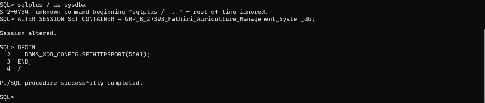

# TUE_27393_FATHIRI_AGRICULTURE_MANAGEMENT_SYSTEM_DB

## Phase IV: PDB CREATION




## Phase VII: Advanced Database Programming and Auditing

1. Problem Statement
Challenge:
In our Agricultural Management System, we must ensure that data integrity and compliance are enforced automatically. In particular, we need to prevent table manipulations (INSERT/UPDATE/DELETE) during core business hours on weekdays and also block any changes on specified public holidays.

Justification:

Triggers can intercept DML and enforce business rules in real time.

Packages allow us to encapsulate shared logic (date checks, holiday lookups).

Auditing provides accountability by logging every attempted action (allowed or denied).

## Reference & Audit Tables

```
-- Holiday reference table for the upcoming month
CREATE TABLE Holiday_Ref (
  holiday_date DATE PRIMARY KEY,
  description  VARCHAR2(100)
);

-- Audit log table
CREATE TABLE Audit_Log (
  log_id      NUMBER GENERATED ALWAYS AS IDENTITY PRIMARY KEY,
  username    VARCHAR2(30) NOT NULL,
  action_time TIMESTAMP   DEFAULT SYSTIMESTAMP,
  object_name VARCHAR2(30) NOT NULL,
  operation   VARCHAR2(10) NOT NULL,  -- INSERT, UPDATE, DELETE
  status      VARCHAR2(10) NOT NULL   -- ALLOWED or DENIED
);

```
### Populate Holiday_Ref for the next month in advance:

```
INSERT INTO Holiday_Ref VALUES (DATE '2025-06-21', 'National Day');
INSERT INTO Holiday_Ref VALUES (DATE '2025-06-30', 'Harvest Festival');
COMMIT;
```

##  Trigger Implementations
  ### Package & Utilities

  ```
CREATE OR REPLACE PACKAGE audit_pkg IS
  PROCEDURE log_action(
    p_user      IN VARCHAR2,
    p_object    IN VARCHAR2,
    p_operation IN VARCHAR2,
    p_status    IN VARCHAR2
  );
  FUNCTION is_restricted RETURN BOOLEAN;
END audit_pkg;
/

CREATE OR REPLACE PACKAGE BODY audit_pkg IS

  PROCEDURE log_action(
    p_user      IN VARCHAR2,
    p_object    IN VARCHAR2,
    p_operation IN VARCHAR2,
    p_status    IN VARCHAR2
  ) IS
  BEGIN
    INSERT INTO Audit_Log(username, object_name, operation, status)
    VALUES (p_user, p_object, p_operation, p_status);
    COMMIT;
  END log_action;

  FUNCTION is_restricted RETURN BOOLEAN IS
    v_today      DATE   := TRUNC(SYSDATE);
    v_dow        NUMBER := TO_CHAR(v_today, 'D');
    v_is_holiday NUMBER;
  BEGIN
    -- 1 = Sunday, 7 = Saturday on some NLS; adjust if needed for your ORACLE_NLS_TERRITORY
    IF v_dow BETWEEN 2 AND 6 THEN
      -- Weekday check
      NULL; 
    ELSE
      RETURN TRUE;
    END IF;
    -- Holiday check
    SELECT COUNT(*) INTO v_is_holiday 
      FROM Holiday_Ref
     WHERE holiday_date = v_today;
    RETURN (v_is_holiday > 0);
  END is_restricted;

END audit_pkg;
/
```

### Simple BEFORE DML Trigger
Applies to all your key tables (Farmer, Asset, Season, etc.). Example on Farmer:

```
CREATE OR REPLACE TRIGGER trg_restrict_farmer_dml
  BEFORE INSERT OR UPDATE OR DELETE ON Farmer
  FOR EACH ROW
BEGIN
  IF audit_pkg.is_restricted THEN
    audit_pkg.log_action(
      USER, 
      'Farmer', 
      ORA_SYSEVENT, 
      'DENIED'
    );
    RAISE_APPLICATION_ERROR(-20001, 'DML on Farmer is restricted today.');
  ELSE
    -- Allow and log
    audit_pkg.log_action(USER, 'Farmer', ORA_SYSEVENT, 'ALLOWED');
  END IF;
END;
/
```
###  Compound Trigger for Bulk Operations
Ensures transactional consistency and single logging per statement:

```
CREATE OR REPLACE TRIGGER trg_bulk_restrict
  FOR INSERT OR UPDATE OR DELETE ON Asset
  COMPOUND TRIGGER

  v_status   VARCHAR2(10);
  v_op       VARCHAR2(10);

  BEFORE STATEMENT IS
  BEGIN
    IF audit_pkg.is_restricted THEN
      v_status := 'DENIED';
    ELSE
      v_status := 'ALLOWED';
    END IF;
    v_op := ORA_SYSEVENT;
  END BEFORE STATEMENT;

  AFTER EACH ROW IS
  BEGIN
    IF v_status = 'DENIED' THEN
      audit_pkg.log_action(USER, 'Asset', v_op, v_status);
      RAISE_APPLICATION_ERROR(-20002, 'Bulk DML on Asset is restricted today.');
    END IF;
  END AFTER EACH ROW;

  AFTER STATEMENT IS
  BEGIN
    IF v_status = 'ALLOWED' THEN
      audit_pkg.log_action(USER, 'Asset', v_op, v_status);
    END IF;
  END AFTER STATEMENT;

END;
/
```
##  Auditing & Security Benefits

Real-time Enforcement: Triggers automatically block unauthorized DML on weekdays and holidays without manual checks.

Comprehensive Logging: Every attempt (allowed or denied) is recorded with timestamp, user, object, and operation status.

Modular Design: The audit_pkg package centralizes the logic for holiday lookup and logging, making maintenance easier.

Regulatory Compliance: An audit trail supports auditors and managers in tracking who did what and when.

